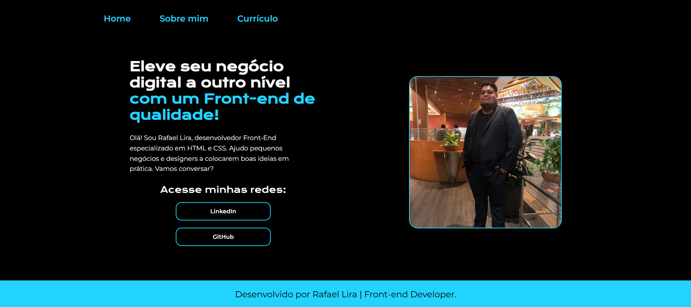

# Portfólio 🚀  
Olá, bem-vindo ao meu projeto de portfólio.

## 📌 Sobre o projeto

Este projeto foi desenvolvido para apresentar meus trabalhos, habilidades e experiências como desenvolvedor, funcionando como um portfólio profissional.

## 🛠️ Ferramentas utilizadas

- HTML  
- CSS  
- Flexbox  

## 📂 Estrutura do projeto

~~~
/
├── preview.png
├── index.html
├── style.css
└── README.md
~~~

## 🔗 Acesso ao projeto

Você pode acessar o projeto aqui:  
👉 **[Link do projeto](https://portifolio-gold-one.vercel.app/)

## 👨‍💻 Feito por

### Rafael Lira

- GitHub: https://www.github.com/lirar0757
- LinkedIn: www.linkedin.com/in/rafael-lira-337b52381
